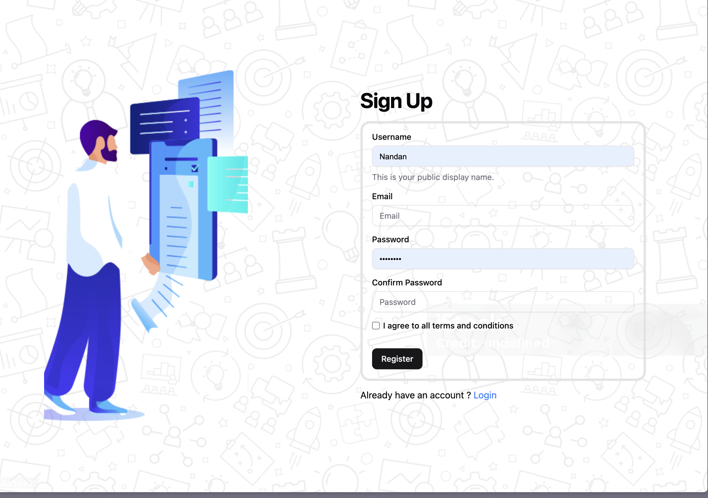
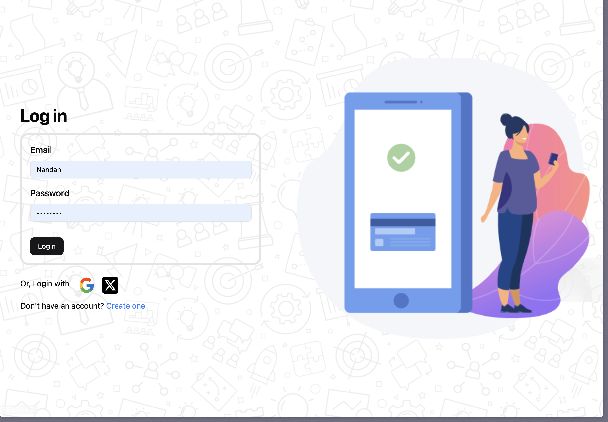
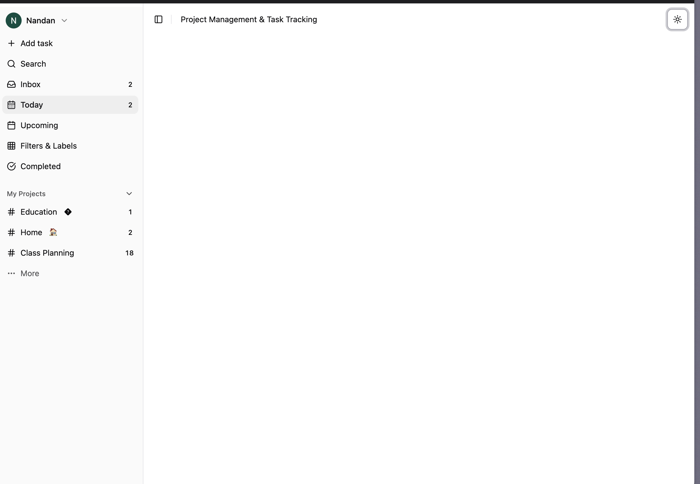
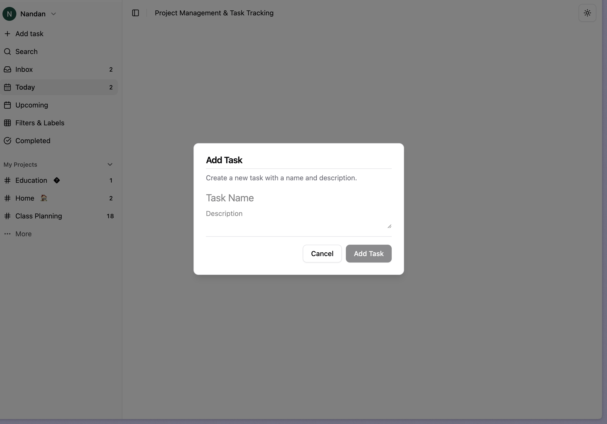

# Todoist Clone (MERN + Google OAuth + shadcn/ui)

A full-stack, Todoist-inspired productivity application built with the MERN stack. This project focuses on modern web development practices, including Google OAuth 2.0 for authentication, a serverless-friendly backend, and a beautiful, accessible UI crafted with **shadcn/ui** and **Tailwind CSS**.

**Live App:** [**https://todo-app-nandan.vercel.app**](https://todo-app-nandan.vercel.app/)  
**API Endpoint:** [**https://todo-nandan-backend.vercel.app**](https://todo-nandan-backend.vercel.app)

---

## ✨ Key Features

- **Secure Google OAuth 2.0:** Sign in quickly and securely with your Google account. Authentication is handled via JWTs stored in `httpOnly` cookies.
- **Full CRUD for Tasks & Projects:** Create, read, update, and delete projects and tasks with ease.
- **Dynamic Views:** A "Today" view to focus on immediate tasks and dedicated pages for each project.
- **Responsive & Accessible UI:** A clean, keyboard-navigable interface that works beautifully on all devices.
- **Serverless Architecture:** Deployed on Vercel for scalability and performance.

---

## 🛠️ Tech Stack

---

## 📸 Screenshots

| Signup Page | Login Page |
| :---: | :---: |
| *Create a new account with email and password.* | *Login with credentials or Google OAuth.* |
|  |  |

| Main App View | Add Task Modal |
| :---: | :---: |
| *View your tasks for the day or by project.* | *Quickly add new tasks with a title and description.* |
|  |  |

---

## 🏗️ Architecture Overview

### Frontend (Vite + React + shadcn/ui)
- **Routing:** `react-router-dom` for all client-side navigation (`/auth/login`, `/app/today`, etc.).
- **UI Components:** Built with the highly accessible and composable **shadcn/ui** library.
- **Data Fetching:** `TanStack Query` for server state management and `axios` for API requests.
- **State Management:** `Jotai` for global state and `react-hook-form` for complex forms.

### Backend (Express.js + Passport.js)
- **Authentication:** `passport.js` with the Google OAuth 2.0 strategy.
- **Database:** Mongoose ODM for modeling `User`, `Project`, and `Task` data.
- **API:** RESTful endpoints protected by JWT middleware.
- **Validation:** `Zod` for robust and type-safe input validation.

### Deployment
- **Frontend & Backend:** Deployed as serverless functions on **Vercel**.
- **Database:** Hosted on **MongoDB Atlas**.

---

## 🔒 Security Highlights

- **`httpOnly` Cookies:** Access and refresh tokens are stored in `httpOnly` cookies, preventing access from client-side JavaScript.
- **`SameSite=None; Secure`:** Cookies are configured for cross-domain use in production, a requirement for modern web apps.
- **Input Validation:** All API inputs are validated with Zod to prevent common vulnerabilities.

---

## 💡 What I Learned

- **OAuth 2.0 Nuances:** Deepened my understanding of OAuth flows, redirect URIs, and secure token handling in a cross-domain environment.
- **Serverless MongoDB:** Mastered connection management patterns for MongoDB in a serverless environment to prevent performance bottlenecks.
- **Component-Driven UI:** Gained valuable experience building a consistent and accessible UI system from the ground up with shadcn/ui.
- **Modern Data Fetching with TanStack Query:** Implemented sophisticated data fetching and caching strategies. Learned how to manage server state effectively using `useQuery` for data retrieval and `useMutation` for CUD operations, along with query invalidation to keep the UI in sync with the database.
- **Iterative Development:** Embraced the practice of shipping small, incremental improvements while maintaining a stable production application.

---

## 🚀 Future Roadmap

- [ ] **Sub-tasks & Recurring Tasks:** Add more complex task management features.
- [ ] **Project Collaboration:** Implement project sharing and an activity log.
- [ ] **Advanced Filtering & Search:** Introduce a command palette for quick navigation and powerful search filters.
- [ ] **Optimistic UI Updates:** Improve perceived performance with optimistic updates for CRUD operations.
- [ ] **Offline Support:** Explore service workers to provide a seamless offline experience.

More tests (unit + e2e)

Links
Live: https://todo-app-nandan.vercel.app

API Health/Docs:https://todo-nandan-backend.vercel.app

Design System: https://ui.shadcn.com (components used)

Contact: np113218@gmail.com

Credits
Inspired by Todoist UX and task flows

UI powered by shadcn/ui + Tailwind

Deployed via Vercel, data on MongoDB Atlas